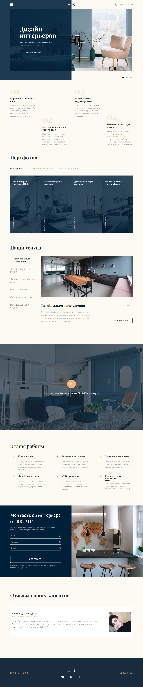

# Личный проект "Cat Energy" [![Build status][travis-image]][travis-url]  [![Dependency status][dependency-image]][dependency-url] 

<table>
  <thead>
    <tr>
      <th>Команда</th>
      <th>Результат</th>
    </tr>
  </thead>
  <tbody>
    <tr>
      <td width="30%"><code>npm i</code></td>
      <td>Установить зависимости</td>
    </tr>
    <tr>
      <td><code>npm start</code></td>
      <td>Запустить сборку, сервер и слежение за файлами</td>
    </tr>
    <tr>
      <td><code>npm start ЗАДАЧА</code></td>
      <td>Запустить задачу с названием ЗАДАЧА (список задач в <code>gulpfile.js</code>)</td>
    </tr>
  </tbody>
</table>

---

## _Не удаляйте и не обращайте внимание на файлы:_
*	### `.editorconfig`
*	### `.gitignore`
*	### `.travis.yml`
*	### `package.json`
*	### `.csscomb.json`
---

## Различные тесты

## Превью сайта

## ТЗ
### Базовые критерии
### Разметка
* Б1. Выполнена HTML-разметка всех страниц проекта и всех элементов на этих страницах.
* Б2. Грубые ошибки в разметке отсутствуют.
* Б3. Документ проходит проверку на валидность https://validator.w3.org/nu/.
* Б4. В разметке отсутствует дублирование кода для одного и того же элемента, с помощью которых элемент отображается в разных местах страницы на разных версиях: мобильной, десктопной, планшетной. Этот критерий не касается элементов, которые скрываются или показываются в разных версиях.
* Б5. Отсутствуют типовые ошибки в разметке по методологии.
* Б32. Названия полей форм привязаны к своим полям с помощью <label>.
  
### Стилизация
* Б6. Раскладка блоков на странице сделана с помощью флексбоксов.
* Б7. В CSS отсутствует !important.
* Б8. Подключены правильные шрифты, их размеры, цвет и толщина равны соответствующим параметрам в макетах и техническом задании.
* Б9. Нестандартные шрифты подключены локально. Формат шрифтов должен быть woff и woff2.
* Б10. Указаны альтернативные варианты шрифта и тип семейства в конце перечисления font-family.
* Б11. При наполнении контентом (как в макете) элементы каждой версии страницы (мобильной, планшетной и десктопной) соответствуют макету.

### CSS-препроцессор
* Б12. Использован CSS-препроцессор.
* Б13. Код стилей должен быть разбит на несколько частей.

### Адаптивность
* Б14. Выполнена вёрстка трёх состояний каждой страницы: мобильной, планшетной и десктопной.
* Б15. В разметке есть правильный вьюпорт тег.
* Б16. Для микросеток использованы флексбоксы.
* Б17. Выполнена ретинизация растровой графики.
* Б19. Логотип должен адаптироваться.
* Б20. Выполнено кадрирование контентных изображений.

### Графика

* Б18. Использована векторная графика.

### Оптимизация
* Б21. «Нежная» ретинизация.

### Сборка проекта
* Б22. Процесс сборки личного проекта настроен с помощью Grunt или Gulp.
* Б23. Все зависимости проекта должны быть указаны в файле package.json. Команда npm i должна установить всё необходимое для того, чтобы сборка проекта работала.
* Б24. Сборка проекта должна запускаться командой npm run build.
* Б25. В результате сборки должна получаться папка build со всеми необходимыми файлами.
* Б26. Папка build со всем её содержимым не должна попадать в Гитхаб.

### Разное
* Б27. Вёрстка идентично отображается в последних версиях браузеров Chrome, Opera, Firefox, Safari, Edge, а также в Internet Explorer 11.
* Б28. Единообразное написание и форматирование кода в HTML, файлах CSS-препроцессора и JavaScript (включая файлы автоматизации).
* Б29. Отсутствует транслит в названиях классов, атрибутах, переменных CSS-препроцессора, названиях примесей и так далее.
* Б30. Мобильное меню должно быть работоспособным при отключённом JavaScript.
* Б31. Проект соответствует техническому заданию

### Дополнительные критерии
### Разметка
* Д1. У всех векторных изображений размер прописан в теге , у встроенных SVG-изображений размер прописан в теге <svg>.
* Д2. Использовано минимально возможное количество HTML-элементов (нет лишних элементов).
  
### Стилизация
* Д4. Для стилизации не использованы #id.
* Д6. Для блока, у которого есть фоновое изображение, прописан фоновый цвет, который соответствует преобладающему цвету изображения (пока изображение не загружено, страница выглядит похоже на макет).
* Д7. Все состояния элементов (смотрите styleguide.psd) прописаны в стилевом файле.
* Д16. Нет глобальных стилей тегов.
### CSS-препроцессор
* Д8. Запрещено использовать цветовые функции для изменения цветовых значений в коде.
* Д9. Примеси не используются для генерации правил с вендорными префиксами.
* Д10. Нет вложенности больше двух уровней.
* Д11. Верное использование & в стилевых файлах.
* Д12. Не используются расширения (extend).
### Тестирование
* Д13. Вёрстка проходит тест на переполнение контентом.
* Д14. Критическая функциональность сайта работоспособна без JavaScript (использовано прогрессивное улучшение).
### Доступность
* Д17. У интерактивных элементов при нажатии или фокусе с клавиатуры есть активное состояние.
* Д18. Все интерактивные элементы имеют текстовое описание.
### Форматирование и внешний вид
* Д19. Код соответствует правилам в EditorConfig
* Д20. Код соответствует правилам в Stylelint.
### Оптимизация
* Д21. Использованы изображения в формате WebP.
* Д22. Использован векторный спрайт.
* Д23. Произведена оптимизация загрузки шрифтов.
### Разное
* Д15. При взаимодействии с элементами (наведение, нажатие) ни сам элемент, ни окружающие его блоки не меняют своего положения (если иное не прописано в техническом задании или styleguide.psd).

[travis-image]: https://travis-ci.org/webistomin/cat-energy.svg?branch=master
[travis-url]: https://travis-ci.org/webistomin/cat-energy
[dependency-image]: https://david-dm.org/webistomin/cat-energy/dev-status.svg
[dependency-url]: https://david-dm.org/webistomin/cat-energy

